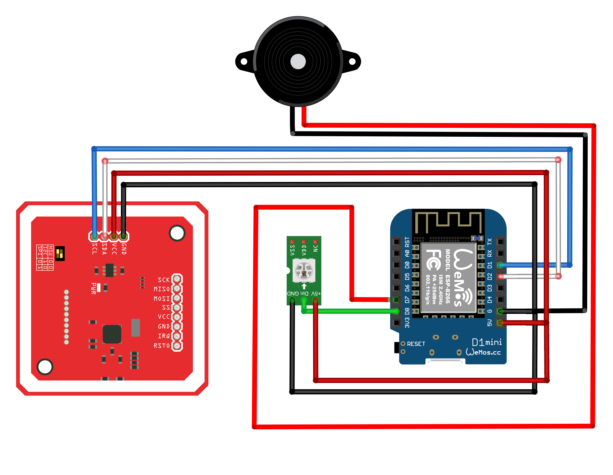

# Tag Reader for Home Assistant
The tag reader is a simple to build/use NFC tag reader, specially created for <a href="https://www.home-assistant.io">Home Assistant</a>. It is using a D1 mini ESP 8266 and the PN532 NFC module. The firmware is built using <a href="https://epshome.io">ESPhome</a>.

# Building the tag reader

To build your own tag reader, you need the following components:

    ESP8266 D1 Mini
    PN532 NFC Reader
    WS2812
    Buzzer

    
# Connecting the components

Make sure that you have set the switches on the PN532 to the following:
- Switch 1: On (up)
- Switch 2: Off (down)

This enables the PN532 module to communicate with the D1 over I2C, and is required for the modules to work together!

To flash the reader firmware to your D1 Mini you point ESPHome at tagreader.yaml.

    ⚠️ The tag reader requires ESPHome 1.16.0.

If you're new to ESPHome, we recommend that you use the ESPHome Home Assistant add-on.
